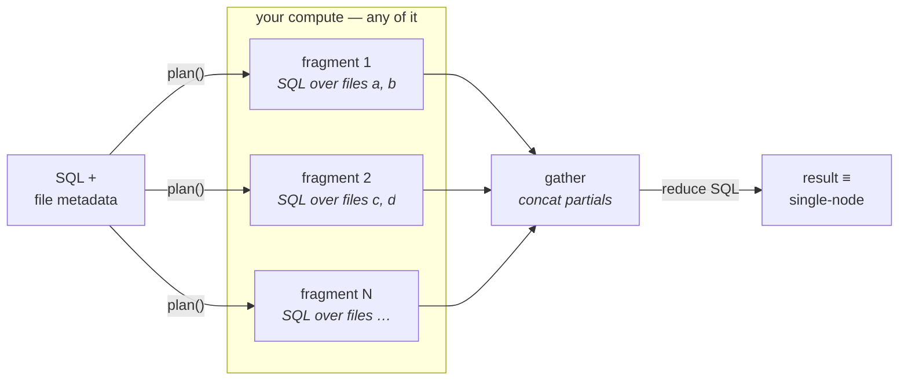

<p align="center">
  
</p>

<p align="center">
  <b>A portable partition planner: SQL + file metadata in, executable SQL fragments + a reduce query out.</b><br>
  <b>Pure planning, no runtime.</b>
</p>

<p align="center">
  <a href="LICENSE"></a>
  
  
  
</p>

<p align="center">
  <a href="https://mmoncadaisla.github.io/splitql/">Documentation</a> ·
  <a href="#install">Install</a> ·
  <a href="#quickstart">Quickstart</a> ·
  <a href="#what-is-and-isnt-eligible">Eligibility</a> ·
  <a href="#partition-sources">Sources</a> ·
  <a href="#zone-map-pruning">Pruning</a> ·
  <a href="#roadmap">Roadmap</a>
</p>

---

splitql is for the case where you have SQL, a pile of independently
readable files, and any compute that can run DuckDB — threads, a VM, a
group of VMs, Ray, Lambdas, Kubernetes jobs, ssh — but no distributed SQL
engine and no wish to operate one. It compiles the provably-parallel
subset of SQL into a **map → gather → reduce** shape, and refuses
everything else loudly.

```
input:   SQL + parquet files (or a DuckLake table)
output:  { eligible, fragments: [sql, ...], reduce: sql }
```



Run each fragment anywhere, concatenate their results into a relation, run
`reduce` over it. The final result is **identical to single-node execution**
— that is the contract, and the whole test suite is a comparison against a
single-node DuckDB oracle (including property-based random queries).

## What this is — and what it is not

- It **is** a compiler from SQL to embarrassingly-parallel relational
  algebra: scans, filters, projections, DISTINCT and decomposable
  aggregates become per-partition fragments plus an algebraic reduce.
- It is **not** distributed SQL. There is no shuffle/exchange: joins,
  cross-partition windows and friends are rejected by design. Run those on
  one node, or on an engine that owns a shuffle — that is Trino/Spark
  territory, deliberately not ours.
- The execution shape is **map → gather → reduce**: every fragment's
  partial result is gathered into ONE relation before the reduce. See the
  gather-bottleneck caveat below before pointing this at high-cardinality
  GROUP BYs.
- Executors are dumb by contract: a worker is "anything that can run a SQL
  string and hand back rows". No agent, no cluster membership, no
  protocol. That is what makes the plan portable across backends.

## Install

```bash
pip install splitql   # depends only on sqlglot
```

## Quickstart

```python
from splitql import plan

p = plan(
    "SELECT region, sum(amount) AS total FROM sales "
    "WHERE d >= DATE '2026-01-01' GROUP BY region",
    files=["s3://lake/sales/a.parquet", "s3://lake/sales/b.parquet",
           "s3://lake/sales/c.parquet", "s3://lake/sales/d.parquet"],
    fragments=2,
)

p.fragments
# ['SELECT region AS g0, SUM(amount) AS a0 FROM READ_PARQUET([...a..., ...b...]) AS sales WHERE ... GROUP BY region',
#  'SELECT region AS g0, SUM(amount) AS a0 FROM READ_PARQUET([...c..., ...d...]) AS sales WHERE ... GROUP BY region']
p.reduce
# 'SELECT g0 AS "region", SUM(a0) AS "total" FROM partials GROUP BY g0'
```

Execution is yours. The minimal in-process runner:

```python
import duckdb, pyarrow as pa

partials = pa.concat_tables(
    [duckdb.connect().execute(f).to_arrow_table() for f in p.fragments]
)
con = duckdb.connect()
con.register(p.partials_table, partials)
result = con.execute(p.reduce).fetchall()
```

Anything about the query that prevents a correct split returns
`eligible=False` with a reason — never an exception, never a wrong split.
Run the original query single-node in that case:

```python
p = plan("SELECT a FROM t JOIN u ON ...", files=[...])
p.eligible   # False
p.reason     # 'joins are not supported'
```

## How aggregates are split

Standard MPP two-phase algebra, applied by rewriting the sqlglot AST:

| original | fragment (partial) | reduce (final) |
|---|---|---|
| `SUM(x)` | `SUM(x) AS a0` | `SUM(a0)` |
| `COUNT(x)` / `COUNT(*)` | `COUNT(...) AS a0` | `SUM(a0)` |
| `MIN(x)` / `MAX(x)` | `MIN/MAX(x) AS a0` | `MIN/MAX(a0)` |
| `AVG(x)` | `SUM(x) AS a0_s, COUNT(x) AS a0_c` | `SUM(a0_s) / SUM(a0_c)` |

GROUP BY keys travel as generated columns (`g0..gk`), aggregates as
(`a0..an`), so the partials relation never collides with user columns.
Expressions around aggregates (`max(x) - min(x)`, `avg(x) * 2 + 1`) are
rebuilt in the reduce. `ORDER BY` + `LIMIT` on plain scans becomes
per-fragment top-k plus a global top-k.

## What is (and isn't) eligible

Eligibility is a **whitelist**: single-table scans, filters, projections,
DISTINCT, GROUP BY (including expressions and aliases), the five aggregates
above, ORDER BY output columns/positions, LIMIT.

Deliberately rejected in v0.1 (returned as `reason`, never guessed at):
joins, subqueries, CTEs, window functions, HAVING, QUALIFY, OFFSET,
`COUNT(DISTINCT ...)`, `FILTER (WHERE ...)`, `DISTINCT ON`, percentage and
`WITH TIES` limits, `USING SAMPLE`, `COLLATE`, table aliases with column
lists, volatile functions, positional GROUP BY, and any aggregate outside
the whitelist. A conservative `False` is always available
as the single-node fallback, so splitql can never make your results wrong —
only your fast path narrower.

## Partition sources

### Plain Parquet

```python
from splitql import plan, ParquetSource, DataFile

plan(sql, files=["a.parquet", "b.parquet"])                  # shorthand
plan(sql, source=ParquetSource([DataFile("a.parquet", size_bytes=512_000_000)]))
plan(sql, file_groups=[["a.parquet"], ["b.parquet"]])        # pre-grouped, verbatim:
                                                             # no pruning, no rebalancing
```

### DuckLake

Feed it the rows of [`ducklake_list_files`](https://ducklake.select/docs/stable/duckdb/metadata/list_files):

```python
from splitql import plan, DuckLakeSource

rows = con.execute("FROM ducklake_list_files('lake', 'sales')").fetchall()
p = plan(sql, source=DuckLakeSource.from_list_files(rows, has_inlined_data=False))
```

**Pin the snapshot.** Derive the file list from one snapshot so every
fragment executes against the same logical version of the table, even
while writers keep committing:

```sql
FROM ducklake_list_files('lake', 'sales', snapshot_version => 42)
```

The source enforces DuckLake's correctness caveats instead of hoping:

- **delete files present** → not eligible (a raw parquet scan would
  resurrect deleted rows);
- **inlined data** (on by default in DuckLake!) is invisible to the file
  list → the gate is fail-closed: splitting requires an explicit
  `has_inlined_data=False` assertion (check via `DATA_INLINING_ROW_LIMIT 0`
  or after flushing inlined data); `True` and `None` (unknown) both refuse;
- **schema evolution**: DuckLake fragment scans use `union_by_name = TRUE`,
  but that unifies only within each fragment's file group — a worker whose
  group holds only old-generation files still cannot bind a newer column,
  and renames/drops need the catalog's column mapping that raw parquet
  scans cannot apply. Unlike inlined data this fails loudly (binder or
  concatenation error), so `has_schema_evolution=None` (unknown) plans
  with a warning, `True` refuses, `False` means you checked.

## Fragment count

splitql plans **fragments** (chunks of work), not workers — how many
execute at once is the caller's business (sequentially, 10 threads, 100
Lambdas: same plan). Explicit `fragments=N` always wins. With file sizes
available (DuckLake always has them), splitql can recommend instead:

```python
plan(sql, source=src)                                # ceil(total / 512MB), capped by #files
plan(sql, source=src, worker_memory_bytes=8 * 2**30) # target = executing machine's memory / 4
plan(sql, source=src, max_fragments=16)
```

Grouping balances by size (LPT greedy) when sizes are known, round-robin
otherwise.

## Zone-map pruning

Files carrying per-column min/max stats are pruned against the WHERE clause
before grouping — fewer fragments, fewer workers, less I/O:

```python
from datetime import date

from splitql import plan, DataFile, ColumnStats

files = [
    DataFile("jan.parquet", 900_000_000,
             stats={"d": ColumnStats(date(2026, 1, 1), date(2026, 1, 31))}),
    DataFile("jun.parquet", 800_000_000,
             stats={"d": ColumnStats(date(2026, 6, 1), date(2026, 6, 30))}),
]
p = plan("SELECT count(*) FROM t WHERE d > DATE '2026-05-01'", files=files)
p.pruned_files   # ['jan.parquet']
```

Pruning is conservative in the safe direction: files without stats, columns
without stats, and any predicate shape it cannot prove (NOT, expressions,
non-literal comparisons) are kept — keeping a file is always correct, its
rows just fail the filter at scan time. Supported proofs: `=`, `!=`, `<`,
`<=`, `>`, `>=`, `BETWEEN`, `IN (literals)`, `IS NULL` (via `null_count`),
with `AND`/`OR` composition, over numbers, strings and dates. If everything
prunes, one fragment survives so global aggregates still return their
zero-rows answer (`COUNT` = 0).

Getting stats without leaving DuckDB — per-file min/max from Parquet footers:

```sql
-- footer stats are VARCHAR: cast INSIDE the aggregates (to the column's
-- real type), or MIN/MAX order row groups lexicographically ('10' < '2')
-- and the wrong bounds make pruning silently drop matching files
SELECT file_name, path_in_schema AS column,
       MIN(CAST(stats_min_value AS DOUBLE)) AS min_value,
       MAX(CAST(stats_max_value AS DOUBLE)) AS max_value
FROM parquet_metadata(['s3://lake/sales/*.parquet'])
GROUP BY 1, 2
```

For DuckLake, the catalog keeps the same information in its
`ducklake_file_column_stats` table.

## Visualize the plan

```python
open("plan.html", "w").write(p.to_html())  # self-contained interactive page
print(p.to_dot())                          # Graphviz
```

The HTML page shows the full execution graph — per-fragment cards with file
lists, byte shares and expandable SQL, flowing scan → partials → reduce →
result — with no external assets (works offline, light/dark aware).

`p.to_json()` gives the whole plan as a JSON envelope for non-Python callers.

## What "identical to single-node" means, precisely

Two caveats apply to the equivalence contract — both inherent to parallel
execution and both present in single-node DuckDB itself:

- **Floating-point aggregation order.** `SUM`/`AVG` over inexact types
  (DOUBLE/FLOAT) are evaluated in a different association order across
  fragments, so results can differ in the last bits. Single-node DuckDB has
  the same property between runs: its multi-threaded aggregation already
  makes FP summation order nondeterministic. Exact types (integers,
  DECIMAL) are exactly equal.
- **Queries that are nondeterministic anyway.** `LIMIT` without `ORDER BY`
  returns an arbitrary row subset, and ties in `ORDER BY ... LIMIT k` break
  arbitrarily — in any engine. The split returns one of the valid answers,
  not necessarily the same one as a given single-node run (planning emits a
  warning for the unordered-LIMIT case). Add a tiebreaker column for full
  determinism.

Queries with deterministic semantics and exact types produce identical
results — that is the tested contract.

## The gather bottleneck (know your GROUP BY cardinality)

Partial results scale with the **number of groups**, not the input size.
`GROUP BY region` gathers a handful of rows per fragment no matter how many
terabytes were scanned; `GROUP BY user_id` over 500M users makes every
partial huge, and the central gather becomes the problem that shuffles
exist to solve — which splitql deliberately does not solve. Rule of thumb:
split when the partials are small relative to the scan.

Roadmap mitigation: **tree reduction**. Decomposable aggregates re-reduce —
the reduce query is itself eligible SQL over the partials — so partials can
be combined in fan-in stages instead of one central gather. That relieves
coordinator bandwidth; it still is not a shuffle.

## Correctness story

Distributed planning has a free oracle: the same query on a single node.
The test suite exploits it everywhere — a fixed battery of query shapes
(NULL-heavy aggregates included) plus seeded property-based random queries,
each executed both ways and compared. If fragments + reduce ever diverge
from single-node DuckDB, that's a bug, full stop.

## Roadmap

- `HAVING` (rewrites cleanly into the reduce)
- `COUNT(DISTINCT ...)` via exact re-aggregation or HLL sketches
- Iceberg / Delta partition sources (same metadata shape as DuckLake)
- Non-file scan sources (e.g. Zarr chunk ranges via the `zarr` DuckDB
  community extension — the partition unit becomes a chunk-grid slice
  instead of a file list)
- Dialect transpilation of fragments via sqlglot
- Tree reduction for high-cardinality gathers

## License

Apache-2.0
