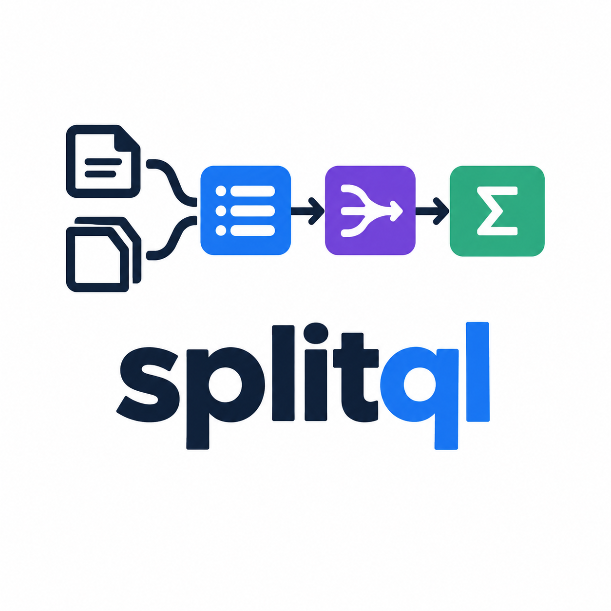
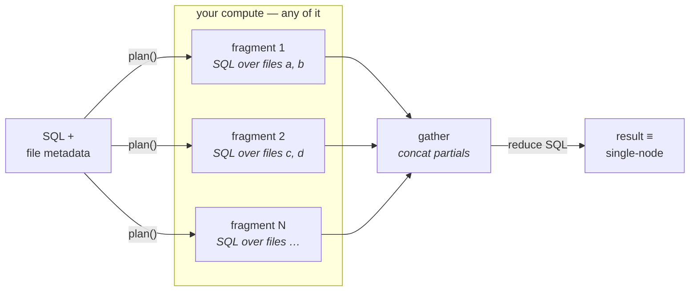

# splitql

<p align="center">
  
</p>


**A portable partition planner: SQL + file metadata in, executable SQL
fragments + a reduce query out. Pure planning, no runtime.**

splitql is for the case where you have SQL, a pile of independently
readable files, and any compute that can run DuckDB — threads, a VM, a
group of VMs, Ray, Lambdas, Kubernetes jobs, ssh — but no distributed SQL
engine and no wish to operate one. It compiles the provably-parallel
subset of SQL into a **map → gather → reduce** shape, and refuses
everything else loudly.

```
input:   SQL + parquet files (or a DuckLake table)
output:  { eligible, fragments: [sql, ...], reduce: sql }
```



Run each fragment anywhere, concatenate their results into a relation, run
`reduce` over it. The final result is **identical to single-node execution**
— that is the contract, and the whole test suite is a comparison against a
single-node DuckDB oracle (including property-based random queries).

## What this is — and what it is not

- It **is** a compiler from SQL to embarrassingly-parallel relational
  algebra: scans, filters, projections, DISTINCT and decomposable
  aggregates become per-partition fragments plus an algebraic reduce.
- It is **not** distributed SQL. There is no shuffle/exchange: joins,
  cross-partition windows and friends are rejected by design. Run those on
  one node, or on an engine that owns a shuffle — that is Trino/Spark
  territory, deliberately not ours.
- The execution shape is **map → gather → reduce**: every fragment's
  partial result is gathered into ONE relation before the reduce. See the
  [gather-bottleneck caveat](guarantees.md#the-gather-bottleneck) before
  pointing this at high-cardinality GROUP BYs.
- Executors are dumb by contract: a worker is "anything that can run a SQL
  string and hand back rows". No agent, no cluster membership, no
  protocol. That is what makes the plan portable across backends.

## Where to next

- [Quickstart](quickstart.md) — install, plan a query, run the fragments.
- [Eligibility](eligibility.md) — what splits, what is rejected, and how
  aggregates decompose.
- [Partition sources](sources.md) — plain Parquet and DuckLake.
- [Guarantees](guarantees.md) — what "identical to single-node" means,
  precisely.
